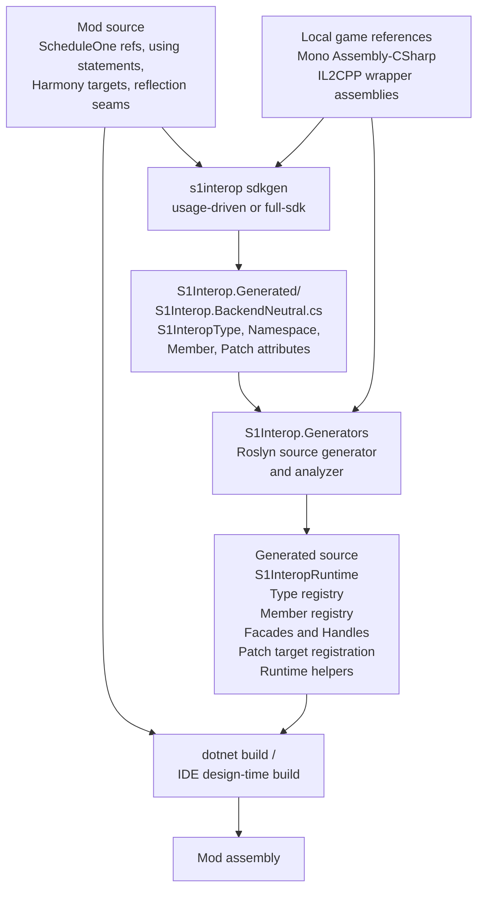
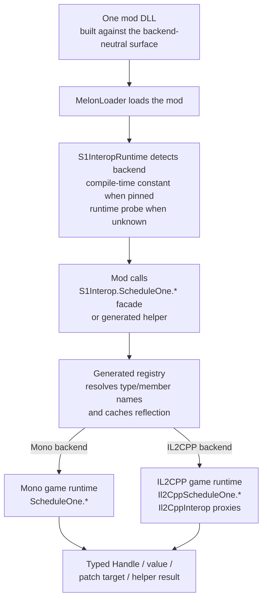

# Architecture

This page shows the moving parts behind SDK generation and the backend-neutral single-assembly workflow.

S1Interop has two halves:

- the CLI, which inspects projects and writes declaration files;
- the generator package, which runs during compilation and emits the code your mod uses.

## SDK generation flow

`sdkgen` does not directly create the facade code. It writes declarations. The generator reads those declarations during build and emits the runtime registry, facades, typed handles, diagnostics, and helper code.

That split is why S1Interop can be adopted in pieces. A mod can use only diagnostics, only generated patch/member helpers, or the full generated facade path.

## Single-assembly runtime flow

The shipped DLL should not contain game assemblies or generated IL2CPP wrappers. It contains your mod code plus generated S1Interop source. At runtime, the generated registry resolves the active game surface and routes calls to the matching Mono or IL2CPP type.

## Where each command fits

| Step | Command or package | What it owns |
| --- | --- | --- |
| Inspect an existing mod | `s1interop analyze` | Project shape, references, runtime symbols, and source-risk findings. |
| Add guardrails | `s1interop lint` / `build-hook` | Command-line or build-time checks without requiring generated facades. |
| Add generator support | `s1interop init` | Generator package reference and an editable declaration file. |
| Write declarations from source usage | `s1interop sdkgen` | `S1InteropType`, namespace, member, and patch declarations. |
| Emit code during build | `S1Interop.Generators` | Runtime detection, registries, facades, handles, helper bridges, and diagnostics. |
| Validate without touching the project | `s1interop verify-migration` | Sandbox migration/build checks. |

For the author-facing adoption paths, see [Use cases](use-cases.md). For the symbols emitted by the generator, see [Generated output](generator-package.md).
